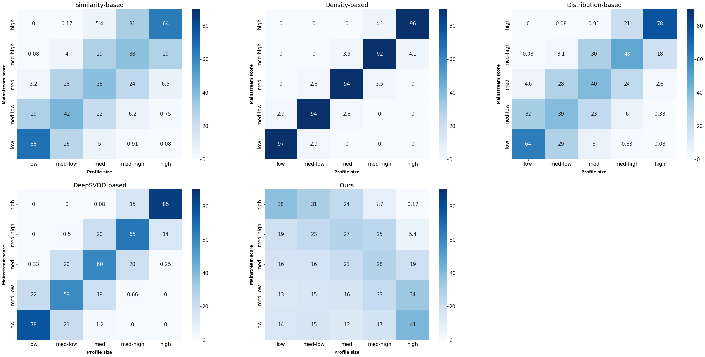

# Utilizing Implicit Feedback for User Mainstreaminess Evaluation and Bias Detection in Recommender Systems

This repository contains code, datasets and results for the BIAS 2023 paper: Utilizing Implicit Feedback for User Mainstreaminess Evaluation and Bias Detection in Recommender Systems.

> Our code are based on the repository:  https://github.com/Zziwei/Measuring-Mitigating-Mainstream-Bias


## Environment

The code are implemented and tested under the following environment:

- python=3.x
- pytorch=1.8.2
- pandas=1.4.1
- numpy=1.22.3
- tqdm
- matplotlib=3.5.1
- scipy=1.7.3
- tensorflow=2.x

## Structure

We describe the structure of directories and files in the following:

```
 - analysis
  - Profile&MS_score			Results for the relationship between profile size and 									the mainstream score
  - Utility&MS_score			Results for the relationship between recommendation 									utility and the mainstream score
  - analysis.ipynb				Analysis implementation
  
- data_process
  - visualization
    - visualize.py				Visualize the distribution of datasets
  - split_data.ipynb			Split data into train, valid and test sets
  - statistic.py				Generate the 'data_statistic.pkl' file

- evaluation
  - mainstream_score 			Evaluation results
  - methods						Mainstreaminess Evaluation approaches
    - DeepSVDD.py
    - MS_Score_eval.ipynb		
    - ...

- mod_data
  - ML1M
    - rec_res 					Recommendation result
    - sep_data  				Train, valid and test sets
    - ML1M.csv 					Dataset after preprocessing
  - ...
  - data_statistic.pkl  		Statistics of all datasets
  
- model  						Recommendation model
  - VAE.py
  - ...
 
- org_data  					Original dataset and preprocess procedure
  - ML1M
    - ratings.dat 			    
    - preprocess.ipynb  		Preprocessing implementation
  - ...
```

## Preprocessing

We provide `preprocess.ipynb  ` for every dataset in `org_data`. Datasets after preprocessing will be stored in `mod_data` .

To store statistics for all datasets and generate the `data_statistic.pkl`  file, use the following command:

```
python data_process/statistic.py
```

To visualize the long-tail distribution of datasets, use the following command:

```
python data_process/visualization/visualize.py
```

Run `data_process/split_data.ipynb` to split dataset into train, validation and test sets.

## Mainstreaminess Evaluation

Run `evaluation/MS_Score_eval.ipynb` to evaluate users' mainstream scores by `similarity-based`, `distribution-based`, `density-based` and **Our approach**. 

To evaluate users' mainstream scores by `DeepSVDD-based` approach, use the following command:

```
python evaluation/methods/DeepSVDD.py
```

Evaluation results will be stored in `evaluation/mainstream_score`.

## Running Recommendation

To run recommendation by VAECF model, use the following command:

```
python model/VAE.py
```

Recommendation results will be stored in `mod_data/{dataset}/rec_res`.

## Analysis of Evaluation Approaches

Run `analysis/analysis.ipynb` to analyze the evaluation results of different approaches.



Results for the relationship between profile size and the mainstream score will be stored in `Profile&MS_score`,  Results for the relationship between recommendation utility and the mainstream score will be stored in `Utility&MS_score`.

